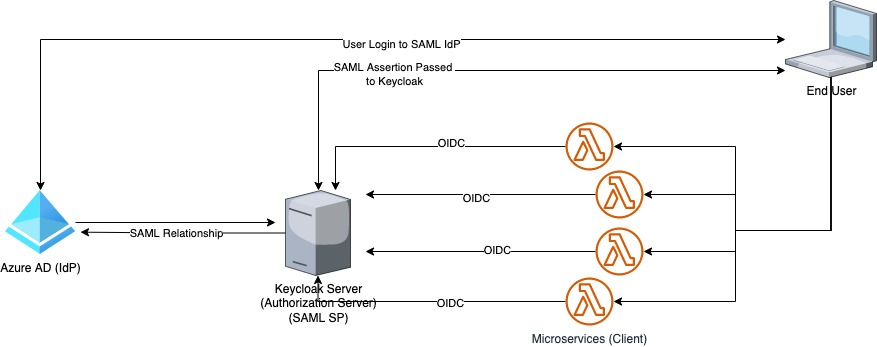

Do you have a collection of microservices that you've been painstakingly integrating into an authentication service one by one? Maybe you're running these services in a federated user environment, or you need a way to control authentication from a single point. Regardless of your situation, it is important to consider how to design an authentication system that is robust, extensible, and meets business requirements.

Today, we'll be looking at a few standards to integrate authentication into microservices through a centralized identity and access management system. We'll be reviewing [Security Assertion Markup Language](https://www.okta.com/blog/2020/09/what-is-saml/) (SAML) [OpenIDConnect](https://www.okta.com/openid-connect/), and [Oauth2](https://developer.okta.com/blog/2017/06/21/what-the-heck-is-oauth). We'll also begin to discuss how to integrate these services into applications at a high level. This article will begin a series that journeys through the process of integrating authentication at the system, backend, and frontend level. Our application model will follow btopro's microservice design process, with the goal of adding authentication to the [threaded-discussion web component](https://github.com/mayormaier/threaded-discussion).

Without further ado, lets get started!

## Authentication standards

### Key Terms

- **Authentication:** The process of confirming a user's identity
- **Authorization:** The use of authentication data to grant access based on a given user's permissions.

### SAML

SAML is a standard that passes credentials from Identity Providers (IdP) to Service Providers (SP) aka applications ([https://www.okta.com/blog/2020/09/what-is-saml/](https://www.okta.com/blog/2020/09/what-is-saml/)). IdPs *Authenticate* users (e.g., Microsoft Active Directory) and SPs *authorize* users.

SAML passes informaiton between providers (and the user browser) via *SAML Assertions*. Assertions are simply XML Documents that provide informaiton about a user.

- **Authentication assertions** prove a user’s identity.
- **Attribution assertions** pass SAML attributes—the pieces of data that provide information about the user—to the service provider.
- **Authorization assertions** confirm whether the user is authorized to use a service—and what degree of authorization they have

### OAuth2

OAuth2 is a standard for "secure delegated access", or Authorization between applications. It provides claims for a smaller service (e.g., mycoolapp.com) to access data on another service, (e.g., Facebook). OAuth makes use of tokens (usually JWTs) to delegate access to applications for a set of resources.

An important thing to remember is:
    >"OAuth is NOT about authenticating the user, and this is key. OAuth 2.0 alone says absolutely nothing about the user. You just >have a token to get access to a resource." *Matt Raible, What the heck is OAuth2?*

### OpenIDConnect

Building on top of the OAuth2 Framework, OpenIDConnect (OIDC) provides authentication via an *ID Token*. This enables systems to share authentication state and user profile information in a predictable format. Without OpenIDConnect, developers are left to find an arbitrary authentication framework to combine with OAuth, which is complex and challenging.

In regards to OpenIDConnect, there are a view parties that need to communicate:

- **Resource Owner:** A user
- **Client:** A service (e.g. mycoolapp.com) that needs information
- **Authorization Server:** The identity provider of the resource server
- **Resource Server:** System containing information that the client needs

OpenIDConnect provides a set of standards that developers can use to connect various systems predictably:

- **Scopes:** While OAuth defines scopes in an abstract sense, OIDC defines a standard set of scopes (openid, profile, email, and address).
- **Claims:** Similarly, OIDC explicitly defines a set of claims that the scopes provide. These claims contain sets of user information.
- **ID Token:** The ID Token contains information used to federate identity across applications.
- **userinfo Endpoint:** OIDC defines a standard set of endpoints. The `/userinfo` endpoint provides identity metadata verification to provide interoperability.
- **JWTs:** OIDC utilizes the JSON Web Token (JWT) standard to sign the ID token, ensuring a cryptographically strong identity statement.

## Centralized Identity Providers and SSO

Authorization and Authentication protocols, such as those that we discussed previously, allow developers to separate their identity management systems from their applications. In this case, a single authentication source and user base can be used for a wide variety of applications. This is particularly useful in the enterprise environment, where users must access many resources but should not have independent user accounts for each service. Similarly, Authentication and Authorization can link many microservice to a single identity provider that is independent from the service itself, leading to a more loosely coupled application.

In this series, we will be implementing [Keyloak](https://www.keycloak.org/) as the bridge between a federated identity provider and our microservice applications. This will simplify the integration of additional microservices into our environment, as we will only need to interface with the identity provider once.

Additionally, we will make use of a feature in Keycloak called roles. Roles are a specific tag assigned to users within Keycloak, and are passed to the application. Roles enable developers to define permission sets in their application for a given role, without considering the individual users that will assume that role.

## High-Level Authentication Flow

The image above shows a high-level view of the authentication and authorization flow that we will build. Firstly, we will deploy the Keycloak server which will act as the SAML Service Provider and the OIDC Authentication Server. Next, we will configure the Keycloak server to use Azure Active Directory as the SAML IdP. This will enable users to log in to our applications. I will configure the microservice applications as OIDC clients. Because of the Single Sign On capability within Keycloak, authenticating once with the server will enable users to access all microservices on the page.

As we progress in this series we will develop a pattern to integrate Keycloak into a micro-frontend service, with the goal of expanding authentiation to 10s of services on a single page. Follow along to learn more!

## References

[What’s the Difference Between OAuth, OpenID Connect, and SAML?](https://www.okta.com/identity-101/whats-the-difference-between-oauth-openid-connect-and-saml/)
[What Is SAML and How Does It Work?](https://www.okta.com/blog/2020/09/what-is-saml/)
[What is OpenID Connect?](https://www.okta.com/openid-connect/)
[What the Heck is OAuth?](https://developer.okta.com/blog/2017/06/21/what-the-heck-is-oauth)
[OAuth2](https://oauth.net/2/)
